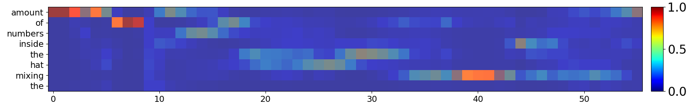
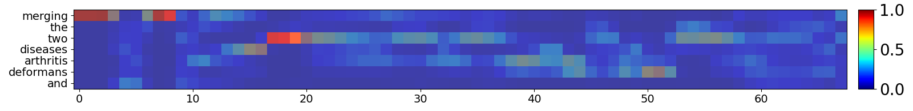

# JEGAL: ***J***oint ***E***mbedding for ***G***estures, ***A***udio, and ***L***anguage

This code is for our paper titled: **Understanding Co-speech Gestures in-the-wild**.<br />
**Authors**: [Sindhu Hegde](https://sindhu-hegde.github.io), [K R Prajwal](https://www.robots.ox.ac.uk/~prajwal/), [Taein Kwon](https://taeinkwon.com/), [Andrew Zisserman](https://scholar.google.com/citations?hl=en&user=UZ5wscMAAAAJ) 

|   📝 Paper   |   📑 Project Page    |  📦 AVS-Spot Dataset | 🛠 Demo  | 
|:-----------:|:-------------------:|:------------------:|:------------------:|
| [Paper](https://arxiv.org/abs/2503.22668) | [Website](https://www.robots.ox.ac.uk/~vgg/research/jegal/) | [Dataset](https://huggingface.co/datasets/sindhuhegde/avs-spot) | Coming soon | 
<br />

<p align="center">
    
</p>

We present **JEGAL**, a Joint Embedding space for Gestures, Audio and Language. Our semantic gesture representations can be used to perform multiple downstream tasks such as cross-modal retrieval, spotting gestured words, and identifying who is speaking solely using gestures.

## News 🚀🚀🚀

- **[2025.08.20]** 🔥 **Inference code** released - It is now possible to extract the gesture embeddings for any real-world video
- **[2025.08.20]** 🧬 JEGAL **pre-trained** checkpoints released
- **[2025.07.24]** 🏆 JEGAL is accepted as an <span style="color:red;">ORAL</span> paper at  **ICCV 2025**!!!
- **[2025.03.31]** 📋 Paper released on [arXiv](https://arxiv.org/abs/2503.22668)
- **[2025.03.29]** 🤗 Our new gesture-spotting dataset: **AVS-Spot** is released!
  
  
## Datasets and Benchmarks

We present three new evaluation datasets for the three tasks: 
 1. Gesture word spotting: AVS-Spot dataset
 2. Cross-modal retrieval: AVS-Ret dataset
 3. Active speaker detection: AVS-Asd dataset

Refer to [dataset section](https://github.com/Sindhu-Hegde/jegal/tree/main/dataset) for details on downloading and pre-processing these datasets. 
  

## Installation

Clone the repository
`git clone https://github.com/Sindhu-Hegde/jegal.git`

Install the required packages (it is recommended to create a new environment)
```
python -m venv env_jegal
source env_jegal/bin/activate
pip install -r requirements.txt
```

FFmpeg is also needed, install if not already present using: `sudo apt-get install ffmpeg==4.4.2`

**Note:** The code has been tested with `Python 3.12.7` 

## Checkpoints

Download the trained models and save in `checkpoints` folder

|Model|Download Link|
|:--:|:--:|
| Visual Feature Extractor (GestSync) | [Link](https://www.robots.ox.ac.uk/~vgg/research/jegal/checkpoints/gestsync.pth)  |
| Gesture model (JEGAL) | [Link](https://https://www.robots.ox.ac.uk/~vgg/research/jegal/checkpoints/jegal.pth) |


## Inference on a real-world video

#### Step-1: Pre-process the video

The first step is to preprocess the video and obtain gesture crops. Run the following command to pre-process the video:

```
cd preprocess
python inference_preprocess.py --video_file <path-to-video-file>
cd ..
```

The processed gesture tracks (video and audio files) are saved in: `<results/video_file/preprocessed/*.avi>`. The default save directory is `results`, this can be changed by specificying `--preprocessed_root` in the above command. Once the gesture tracks are extracted, the below script can be used to extract gesture and/or content embeddings. 

#### Step-2: Inference - Extract embeddings

```bash 
python inference_embs.py \
  --checkpoint_path_gestsync <gestsync-checkpoint-path> \
  --checkpoint_path_jegal <jegal-checkpoint-path> \
  --modalities <vta/vt/va/ta/v/t/a> \
  --video_path <path-to-preprocessed-video-file> \
  --audio_path <path-to-preprocessed-audio-file> \
  --text_path <path-to-text-file-with-word-boundaries> \
  --res_dir <folder-path-to-save-the-extracted-embeddings>
```

By default, content embeddings are extracted using both text and audio modalities, which provides the best performance.  However, JEGAL also supports missing modalities at inference time.  You can control this using the `--modalities` flag and by providing the corresponding input paths.

-   **All three modalities (visual + text + audio)**
    -   Produces **gesture embeddings** and **content embeddings**
    -   Use: `--modalities vta`
    -   Requires: `--video_path`, `--audio_path`, and `--text_path`
        
-   **Two-modality combinations**
    -   Use: `--modalities vt` (visual + text-only) or `--modalities va` (visual + audio-only) or `--modalities ta` (combines text and audio for content)        
    -   Requires the corresponding paths
        
-   **Single-modality embeddings**
    -   Use: `--modalities v`, `t`, or `a`
    -   Extracts embeddings for visual, text, or audio individually
    
Following pre-processed examples are available for a quick test in `samples` folder: 
- `sample1.avi`, `sample1.wav`, `sample1.txt`
- `sample2.avi`, `sample2.wav`, `sample2.txt`

Note: Step-1 need to be skipped for these examples, since they are already pre-processed.

Example run:
```bash
python inference_embs.py \ 
	--checkpoint_path_gestsync checkpoints/gestsync.pth \ 
	--checkpoint_path_jegal checkpoints/jegal.pth \ 
	--modalities vta \ 
	--video_path samples/sample1.avi \ 
	--audio_path samples/sample1.wav \ 
	--text_path samples/sample1.txt \ 
	--res_dir results/sample1
```
On running the above command, the extracted  JEGAL embeddings  are saved in:
`results/sample1/sample1.pkl` 

The  `.pkl`  file contains:
-   gesture_emb:  `numpy array`  of shape  `(T, 512)`
    -   `T`  = number of video frames
    -   `None`  if  `v`  is not included in  `--modalities`
-   content_emb:  `numpy array`  of shape  `(W, 512)`
    -   `W`  = number of words (from text/audio)
    -   `None`  if  `t`  or  `a`  is not included in  `--modalities`    
-   info:  `dict`  with keys  `{fname, word_boundaries}`
    -   `fname`: input file name
    -   `word_boundaries`: timestamped boundaries for each word [`None`  if  `t`  or  `a`  is not included in  `--modalities`]

 
#### Plotting the heatmap to spot the gestured words

Once the gesture and content embeddings are extracted, they can be used to plot the similarity heatmap which helps in understanding which words have been gestured in the video. Run the below command to save the heatmap:

```
python utils/plot_heatmap.py --path <path-to-the-JEGAL-pkl-file> --fname <file-name-of-the-result-heatmap>
```

Example run:
```
python utils/plot_heatmap.py --path results/sample1/sample1.pkl --fname heatmap_sample1
```

For the examples provided, the following heatmaps are obtained:
<table align="center">
  <tr>
    <td align="center">
      Sample-1<br>
      
    </td>
    <td align="center">
      Sample-2<br>
      
    </td>
  </tr>
</table>

## Training

The training scripts, along with detailed instructions to fine-tune on custom datasets will be available soon. Until then, stay tuned and watch the repository for updates!


## Citation

If you find this work useful for your research, please consider citing our paper:

```bibtex
@inproceeding{hegde2025jegal,
      title={Understanding Co-speech Gestures in-the-wild}, 
      author={Sindhu B Hegde and K R Prajwal and Taein Kwon and Andrew Zisserman},
      year={2025},
      booktitle={Arxiv}
}
```